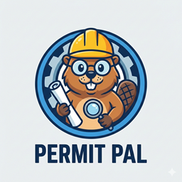

A web-based application that helps you discover licenses, permits, certifications, and other paperwork required to accomplish a goal in a given location. Describe what you want to do and where (e.g., open a restaurant in Atlanta, become a barber in New York City), and Permit Pal uses an LLM to generate a structured report with agencies, links, requirements, and regulatory sources. Optional RAG (retrieval-augmented generation) can augment the report using your own document corpus.

This application is a final capstone project for Cohort 3 of the ByteByteAI AI Engineering course.  It was created to demonstrate concepts like workflows, asynchronous execution, prompt engineering techniques like few-shot, and local file RAG implementation.  In addition to covering concepts from the course, this project explores other areas like expirementing with model configurations, implementing concurrent programming techniques in Python, utilizing commercial models (Gemini from Google), and using previously unused frameworks (LlamaIndex).

This project is "demo quality".  It does not have any unit tests, minimal error handling, a small breadth of functionality, and a very small corpus of data for RAG.  It is not meant to showcase a production implentation nor is it meant to maximize effectiveness, efficiency, performance, or optimization for scale.

## Features

- **Clean Architecture**: Modular design with clear separation between UI, report generation, and RAG utilities
- **Natural-language prompts**: Describe your goal and location (e.g., "I want to open a restaurant in Atlanta, Georgia")
- **Structured reports**: Markdown tables with permit/document name, agency, agency link, agency type, requirements, regulatory source, and source link
- **Multiple LLM backends**: Google Gemini (cloud) or local models via Ollama (e.g., phi4-mini, qwen2.5, llama3.2)
- **Optional RAG**: Enable RAG to supply additional context from your own PDF documents (relevancy check + vector retrieval + synthesis)
- **Web interface**: NiceGUI-based UI with dark theme, model selection, and RAG toggle

## Requirements

- Python 3.10 or higher (recommended for type hints and modern async)
- External dependencies: see `requirements.txt` (e.g., NiceGUI, LlamaIndex, LangChain Google GenAI or Ollama for LLMs)
- For **Gemini** models: Google API key (set in `.env` as `GOOGLE_API_KEY`)
- For **Ollama** models: Ollama installed and running locally with the chosen model pulled
- For **RAG**: Ollama available for the RAG pipeline; optional document corpus (e.g., PDFs in the `\data` directory)
- pytest (for running tests; see Testing section)

## Installation

1. Clone or download this repository.
2. Create a virtual environment and install dependencies:

   ```bash
   python -m venv .venv
   .venv\Scripts\activate   # Windows
   # source .venv/bin/activate   # Linux/macOS
   pip install -r requirements.txt
   ```

3. Copy `.env.example` to `.env` and add your Google API key if you plan to use Gemini:

   ```bash
   copy .env.example .env   # Windows
   # cp .env.example .env   # Linux/macOS
   ```

   Edit `.env` and set `GOOGLE_API_KEY=<your-key>`.

4. If using Ollama, install Ollama and pull the desired model (e.g., `ollama pull phi4-mini`).
5. Add a directory called `data` in the project root directory.  This is where files must go to be used for RAG.

## Running the Application

You can run Permit Pal either via the web GUI or from the command line.

### Web GUI

1. Open a terminal in the project directory and activate the virtual environment if needed.

   ```bash
   .venv\Scripts\activate   # Windows
   # source .venv/bin/activate   # Linux/macOS
   ```

2. Run the GUI module directly:

   ```bash
   python src/gui.py
   ```

3. The app will start and display a message with the URL (e.g., `http://localhost:8080/` or similar, depending on NiceGUI defaults).
4. Open your browser and go to the URL shown.
5. To stop the server, press `Ctrl+C` in the terminal.

### Command-line (CLI)

You can run the application logic without the web GUI. Output is printed to the console.

Required arguments:

- `--prompt`: Your goal and location (e.g., "I want to open a restaurant in Atlanta, Georgia")
- `--llm_model`: LLM model name (e.g., `gemini-2.5-pro` for Gemini, or an Ollama model name)

Optional:

- `--rag`: Enable RAG to augment the report with context from your document corpus

Examples:

```bash
python src/permit_pal.py --prompt "I want to open a restaurant in Atlanta, Georgia" --llm_model "gemini-2.5-pro"
python src/permit_pal.py --prompt "I want to open a restaurant in Atlanta, Georgia" --llm_model "gemini-2.5-pro" --rag
```

**Note**: Do not commit your `.env` file; it contains secrets.

## Usage Guide

### 1. Enter your goal and location

- In the text area, describe what you want to accomplish and where (e.g., "I want to open a restaurant in Atlanta, Georgia" or "I want to become a barber in Topeka, Kansas").

### 2. Choose LLM model

- Use the **LLM model** dropdown to select a Gemini model (requires `GOOGLE_API_KEY`) or an Ollama model (requires Ollama running with that model).

### 3. Enable or disable RAG

- Use the **Enable RAG** switch to optionally add context from your document corpus. When enabled, the app uses a concurrent workflow to find relevant files, then embeds and queries them to augment the prompt. Leave off for a quick report using only the LLM.

### 4. Generate report

- Click **Generate report**. The app calls the selected LLM with your prompt (and optional RAG context) and displays the result as a Markdown table in the page.

### 5. Use the report

- The table lists required permits/documents, agencies, links, requirements, and regulatory sources. Use it as a checklist for your project.

## Project Structure

```text
permit-pal/
├── src/                    # Source code
│   ├── __init__.py         # Package initialization
│   ├── gui.py              # NiceGUI web interface to use the app
│   ├── report.py           # Report generation (Gemini/Ollama, create_report)
│   ├── rag_utils.py        # RAG: create context from the corpus in `./data`
│   ├── conc_workflow.py    # Concurrent workflow for relevancy checking
│   ├── rel_check.py        # Relevancy check (is a document relevant to prompt?)
│   └── permit_pal.py       # Run report logic from command line (no GUI)
├── assets/                 # Static assets (e.g., permit_pal_banner.png)
├── data/                   # This directory MUST be present to use the RAG functionality
├── tests/                  # Test suite (pytest; add tests here per AGENTS.md)
├── .env.example            # Example env vars (copy to .env, do not commit .env)
├── requirements.txt        # Python dependencies
├── LICENSE                 # BSD 3-Clause License 
├── AGENTS.md               # Development guidelines and instructions for Cursor
└── README.md               # This documentation
```

## Configuration and Secrets

- **Environment variables**: The app uses `python-dotenv` to load variables from a `.env` file in the project root. Copy `.env.example` to `.env` and set at least `GOOGLE_API_KEY` if using Gemini.
- **`.env`**: Never commit `.env`; it is for local secrets only.
- **Ollama**: For local models, ensure Ollama is installed and the selected model is pulled.  Ollama is required for RAG functionality.

## How It Works

- **Report generation**: Your prompt is sent to the chosen LLM (Gemini or Ollama) with a system prompt that asks for a Markdown table of permits, agencies, links, requirements, and regulatory sources. The response is displayed in the UI.
- **RAG (optional)**: When RAG is enabled, a concurrent workflow first finds documents relevant to your prompt and location. Relevant files are embedded into a vector index; a retriever pulls top chunks and an LLM synthesizes extra context. This context is appended to the system prompt before the main report is generated.
- **Relevancy**: `rel_check` uses an LLM to decide whether a document is relevant to the user’s action and location (e.g., Atlanta restaurant vs. San Diego document = not relevant).

## Code Quality

This project follows Python best practices:

- **PEP 8**: Style guidelines, f-strings, pathlib, context managers.
- **Docstrings**: Google-style docstrings for public functions.
- **Error handling**: Specific exception types; no bare `except` clauses.
- **Security**: No logging of passwords or tokens; secrets only in `.env` and loaded via `load_dotenv()`.

## Testing

The project is set up for pytest. All tests belong in the `tests/` directory and should be runnable with the rest of the suite. See `AGENTS.md` for testing preferences (pytest-style functions, fixtures, descriptive `test_` names).

### Installing test dependencies

Install the project dependencies (pytest is included or add it if needed):

```bash
pip install -r requirements.txt
```

If pytest is not in `requirements.txt`:

```bash
pip install pytest
```

### Running tests

From the project root, run tests in the tests directory:

```bash
pytest tests/
```

Verbose:

```bash
pytest -v
```

Run a specific file or test:

```bash
pytest tests/test_report.py
pytest tests/test_report.py::test_create_report_basic
```

Ensure all tests pass after making changes; add regression tests for any bug fixes.

## Development Status

Parts of this project were developed using Cursor IDE with AI assistance:

- **AI-Assisted Development**: LLM tools were used to create the gui.py file.  The LLM model calls in `report.py` were modified by the LLM tools to make them non-blocking for the GUI execution loop.
- **Code Quality**: PEP 8, docstrings, and security practices as in `AGENTS.md`.
- **Testing**: Tests live in `tests/` and are run with pytest; add or extend tests as functionality grows.

## Troubleshooting

- **"Invalid API key" or Gemini errors**: Ensure `.env` exists, contains `GOOGLE_API_KEY`, and is not committed. Restart the app after changing `.env`.
- **Ollama model not found**: Install Ollama and run `ollama pull <model_name>` for the model you selected.
- **RAG very slow or failing**: Ensure Ollama is running and the RAG model (e.g., phi4-mini) is available. Check that your document corpus path and files are correct in the workflow configuration.
- **Empty or malformed report**: Try a different model or a clearer prompt (action + city/state). Check that the LLM returns valid Markdown tables as requested in the system prompt.
- **Tests failing**: Run `pytest` from the project root; ensure dependencies are installed and that no `.env` or paths assume a different working directory.
- **`AttributeError: module 'pkgutil' has no attribute 'find_loader'`**: The version of NiceGUI used for this project is not compatible with Python version 3.14. A NiceGUI dependency, vbuild, does not support Python 3.14 yet.  If you are using Python 3.14 and encounter this problem running NiceGUI, run the following command to install a patched version of vbuild.

```bash
pip install git+https://github.com/manatlan/vbuild@31157af79eeb8ef86e37f6f4965fcc8a1391d6a1
```

## License

This project is licensed under the BSD 3-Clause License.  
See the LICENSE file for the specific license text.
